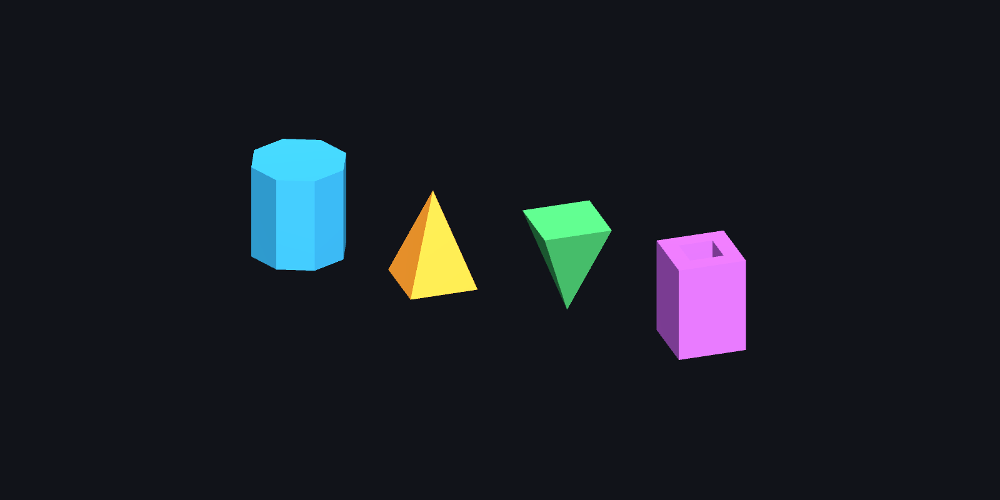

# ShapeEditor issue #3: implementation and measured evidence

Validated locally on 2026-09-16. **41/41 EditMode tests pass with real RealtimeCSG; none skipped.**

The [maintainer's reply](https://github.com/Henry00IS/ShapeEditor/issues/3#issuecomment-5671890841) asks for actual Unity/RealtimeCSG correctness and performance testing. This report records those checks.

## Changes

- `ExternalRealtimeCSG.CreateBrushFromPolygonMesh` constructs control meshes and shapes directly, then calls RealtimeCSG's `BrushFactory.CreateBrush`. All six target modes use it. The dependency remains optional and accessed through cached reflection metadata.
- Spatial vertex welding and keyed half-edge pairing replace the prototype's inconsistent vertex lookup and exhaustive edge-pair scans. Conversion leaves source positions, winding, vertex attributes, and cached planes unchanged.
- Collapsed edges and caps are removed, including both zero-scale pyramid directions. Invalid topology, non-finite coordinates, nonplanar/concave shapes, zero volume and index overflow are rejected before scene object creation. Materials retain their original polygon mapping.
- A tetrahedron face is subdivided into three coplanar triangles to satisfy RealtimeCSG 1.60.1's minimum-count guards. This preserves the solid and face material. Both triangular-pyramid directions and the material mapping pass native tests; no dependency source was changed.
- `SplitNonPlanar4` handles collapsed/collinear quads without an assertion. Spline rebuilding and gizmos exclude the generated `Brushes` container from control points.

## Environment

| Component | Tested value |
|---|---|
| ShapeEditor base | `695aa8931981610a77f068a7d68a1c05e91654d5` |
| RealtimeCSG | 1.60.1, `8ea1d81e917c538d8f4563327c2c657b50a355f0` |
| Unity | 2022.3.62f2 (`7670c08855a9`), Intel editor under Rosetta |
| Native plugin | Supplied macOS x86_64 `RealtimeCSG[1_559].bundle` |
| Host | Apple M2 Pro, macOS 27.0 (26A428) |
| Unity Test Framework | 1.1.33 |

The preinstalled ARM editor was used for compilation and optional-dependency checks. Its architecture cannot load this native plugin; native results above come from the Intel editor with the supplied native plugin.

## Correctness

The [raw NUnit result](Evidence/native-tests.xml) contains **41 passed, 0 failed, 0 skipped**, from the isolated validation project after cleanup. The assembly path is made project-relative; test results and timings are unchanged.

Tests cover real generated render-mesh volumes, both pyramid directions (including tetrahedra), frusta, a wedge, an offset pyramid under a transformed parent, subtraction, all six target modes and rebuilding, depth Undo/Redo followed by ten repeated rebuilds in each pyramid direction, edge connectivity, RealtimeCSG's own validator, texture defaults, per-face materials, unchanged inputs, tolerance-cell boundaries, global winding reversal, repeated closing vertices, invalid geometry and legacy index limits.

The [prototype reproduction](Evidence/prototype-baseline.txt) found **8 incorrect vertex references and 4 zero-length edges** for a square pyramid. The tetrahedron binding restriction and spline control-point bug have regression coverage.

[Optional-dependency checks](Evidence/without-realtimecsg.txt) separately passed compilation/absence detection and 24 generated-topology checks without RealtimeCSG installed. The setup helper was exercised with and without RealtimeCSG in new empty projects.

A supplemental local check loaded the manually authored `new.unity` scene and verified both pyramid directions through ten rebuilds each, preserving native volume, topology and material assignments. That scene-specific check is separate from the 41 portable tests; the scene is not part of this package.

## Performance

Warmed medians from seven alternating samples per path, after two warm-ups. Both paths first pass native-volume and topology checks. Destruction is outside timing. Raw samples: [benchmark.csv](Evidence/benchmark.csv).

| Prism sides | Plane creation (ms) | Direct creation (ms) | Plane creation + rebuild (ms) | Direct creation + rebuild (ms) | Speedup including rebuild |
|---:|---:|---:|---:|---:|---:|
| 4 | 0.202 | 0.156 | 0.720 | 0.533 | 1.35× |
| 16 | 4.011 | 0.416 | 4.462 | 0.822 | 5.43× |
| 32 | 36.675 | 0.837 | 37.681 | 1.653 | 22.79× |
| 64 | 372.132 | 1.835 | 374.591 | 3.181 | 117.78× |
| 128 | 4299.899 | 4.293 | 4297.244 | 6.765 | 635.19× |

These timings measure one brush's creation, with or without `CSGModelManager.EnsureBuildFinished`. They exclude editor startup, destruction and the full target regeneration/UI workflow. They are specific to this machine and workload, not frame-rate claims. Small brushes show little difference. Convexity checks and RealtimeCSG's legacy validation remain nonlinear; the entire converter is not claimed to be O(n).

## Visual evidence

The image below was rendered by Unity from actual native-generated RealtimeCSG meshes and inspected: prism, back-tip pyramid, front-tip pyramid and through-hole subtraction. The demo uses explicit Standard materials to keep the geometry visible independently of package default materials.

## Reproduction and remaining scope

Follow [README.md](README.md) to create a fresh validation project, run the tests and benchmark, and generate the editable demo scene.

Undo/Redo of the depth parameter is covered through Unity's Undo API and explicit target rebuilding. Full interactive authoring workflows, other Unity/RealtimeCSG versions and Windows were not validated. Malformed meshes and T-junctions are rejected rather than repaired. The absolute welding tolerance is `1e-5` per coordinate and planarity/convexity tolerance is `1e-4` in mesh-local units. Texture generation uses RealtimeCSG's default planar mapping, not imported per-vertex UVs.
